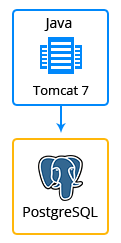

 

# Cyclos 4

### Highlights
This package is designed to deploy Cyclos environment is a feature-rich online banking solution that is easy to use and maintain, flexible, secure and highly customisable. 
Cyclos comes with a range of banking and payment options, a complete e-commerce system and high and low end mobile access channels. The mobile channel offers a scalable and cheap opportunity for banks to enlarge their offer branchless banking.
Cyclos is used by local banks, C3 networks, MFI's, barters, community currencies and time banks. The dynamic structure of Cyclos allows organisations to create a dedicated payment system from scratch just by changing the configuration (without the hassle to make code changes).

### Environment Topology

 

### Specifics

Layer                |     Server    | Number of CTs   by default | Cloudlets per CT   (reserved/dynamic) | Options
-------------------- | --------------| :----------------------------: | :---------------------------------------: | :-----:
AS                   | Tomcat Java |       1                        |           1 / 16                          | -
DB                   |    PostgreSQL      |       1                        |           1 / 16                           | -

* AS - Application server 
* DB - Database 
* CT - Container

**Cyclos Version**: 4.10.4 
**Tomcat Version**: 9.0.8 
**Java Engine**: Java 8 
**PostgreSQL Database**: 9.6.9

### Deployment

In order to get this solution instantly deployed, click the "Get It Hosted Now" button, specify your email address within the widget, choose one of the [Jelastic Public Cloud providers](https://jelastic.cloud) and press Install.

To deploy this package to Jelastic Private Cloud, import [this JPS manifest](../../../raw/master/cyclos-4/manifest.jps) within your dashboard ([detailed instruction](https://docs.jelastic.com/environment-export-import#import)).

More information about Jelastic JPS package and about installation widget for your website can be found in the [Jelastic JPS Application Package](https://github.com/jelastic-jps/jpswiki/wiki/Jelastic-JPS-Application-Package) reference.
